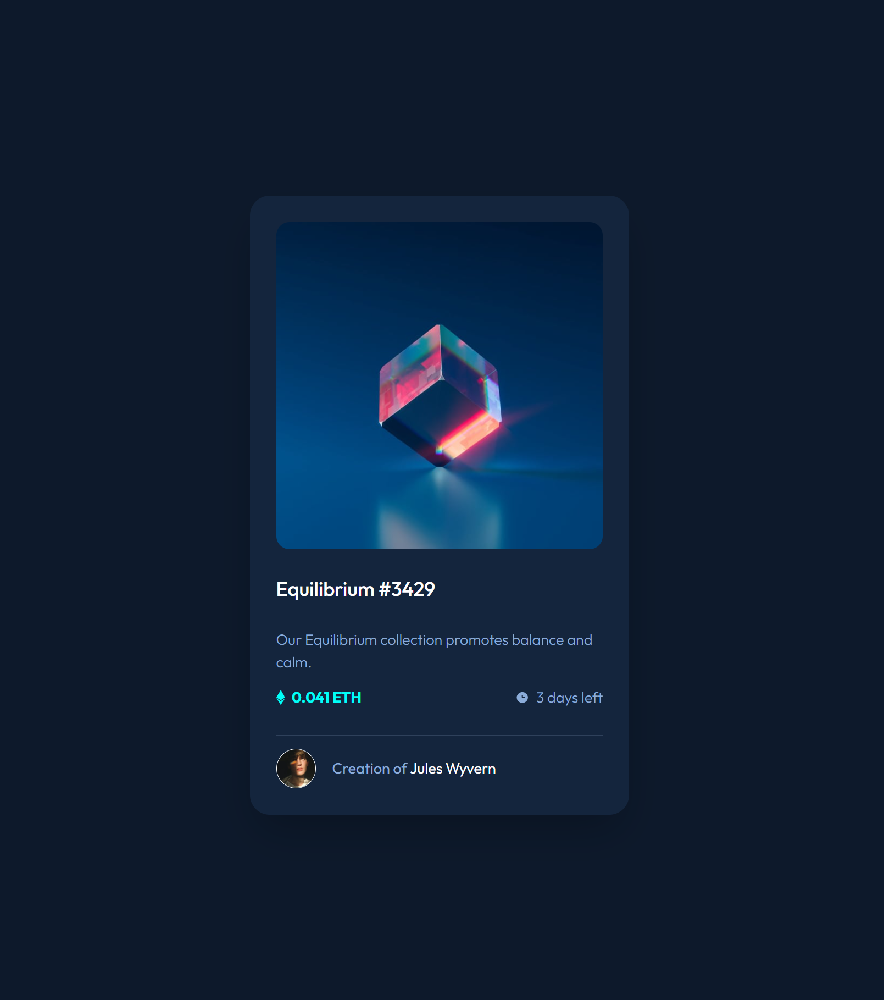
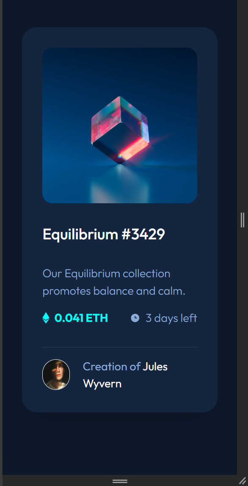

# Frontend Mentor - NFT preview card component solution

This is a solution to the [NFT preview card component challenge on Frontend Mentor](https://www.frontendmentor.io/challenges/nft-preview-card-component-SbdUL_w0U). Frontend Mentor challenges help you improve your coding skills by building realistic projects. 

## Overview

### The challenge

Users should be able to:

- View the optimal layout depending on their device's screen size
- See hover states for interactive elements

### Screenshot

### Links

- Solution URL: [Solution URL](https://github.com/LINDECKER-Charles/FM_NFT_Preview_Card_Component)
- Live Site URL: [Live site URL](https://fm-faq-accordion-beige.vercel.app)

## My process

### Built with

- Semantic HTML5 markup
- CSS custom properties
- Flexbox
- CSS Grid
- Mobile-first workflow
- TailwindCSS

### Useful resources 📚

* [Tailwind CSS documentation](https://tailwindcss.com/docs)
* [Frontend Mentor](https://www.frontendmentor.io) for the challenge and design
* [Google Fonts](https://fonts.google.com/specimen/WorkSans) to get the WorkSans variable font

## Author 👤🖊️📇

* LinkedIn - [Charles LINDECKER](https://www.linkedin.com/in/charles-lindecker/)
* GitHub - [Charles LINDECKER](https://github.com/LINDECKER-Charles)
* Frontend Mentor - [@LINDECKER-Charles](https://www.frontendmentor.io/profile/LINDECKER-Charles)
